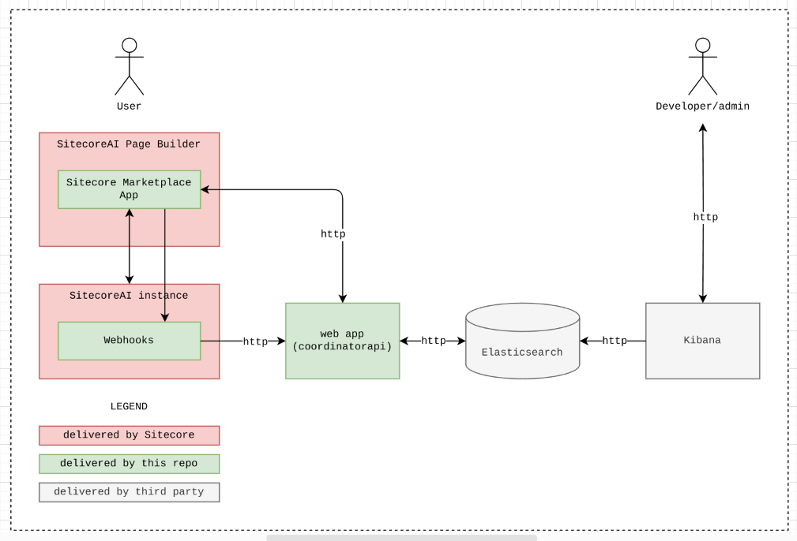
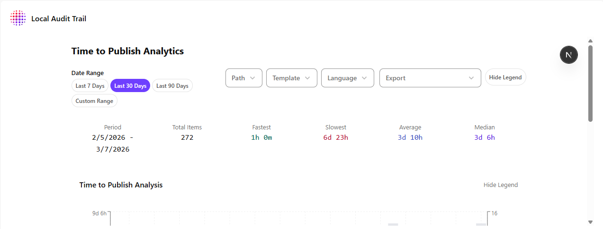
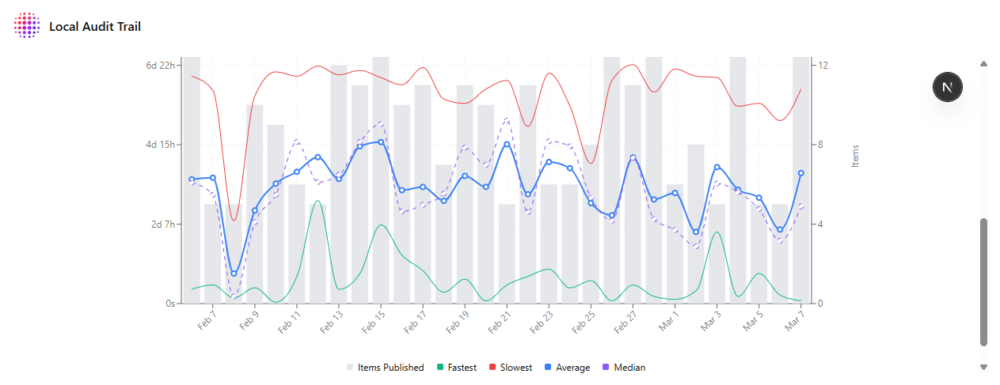
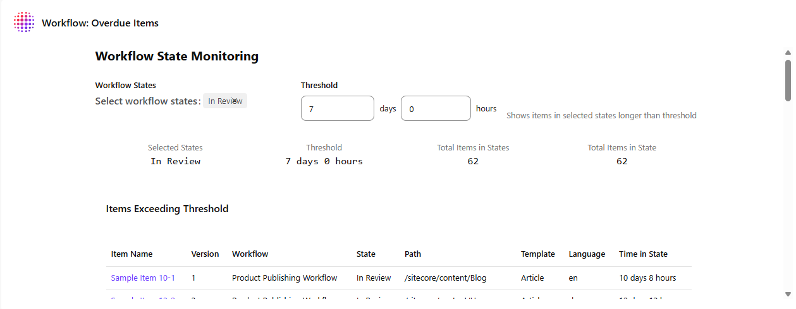
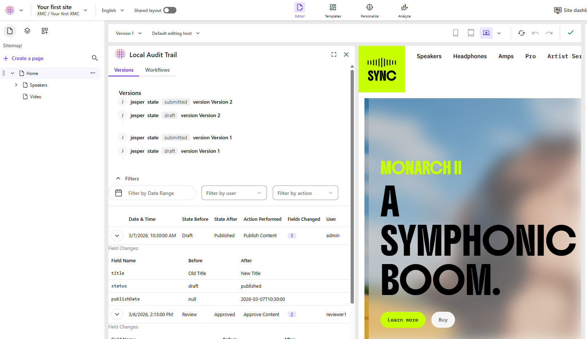
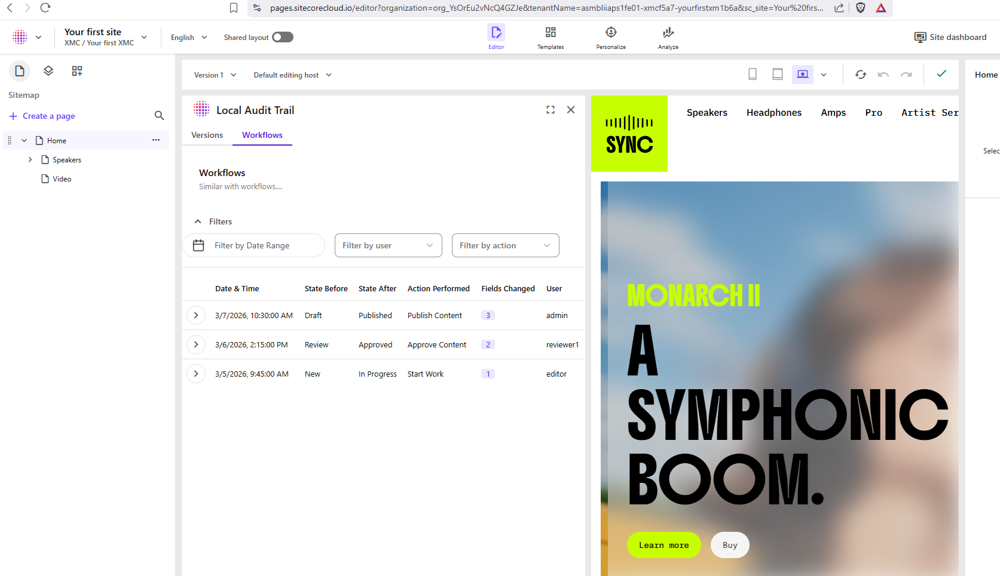
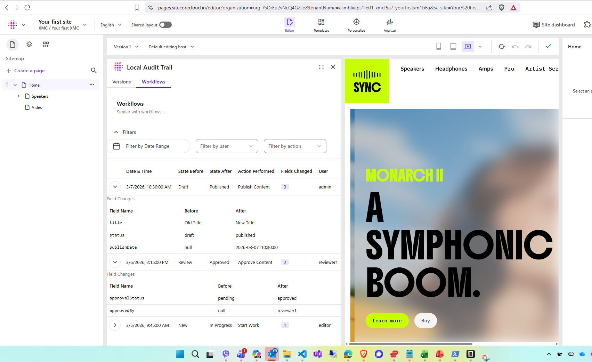
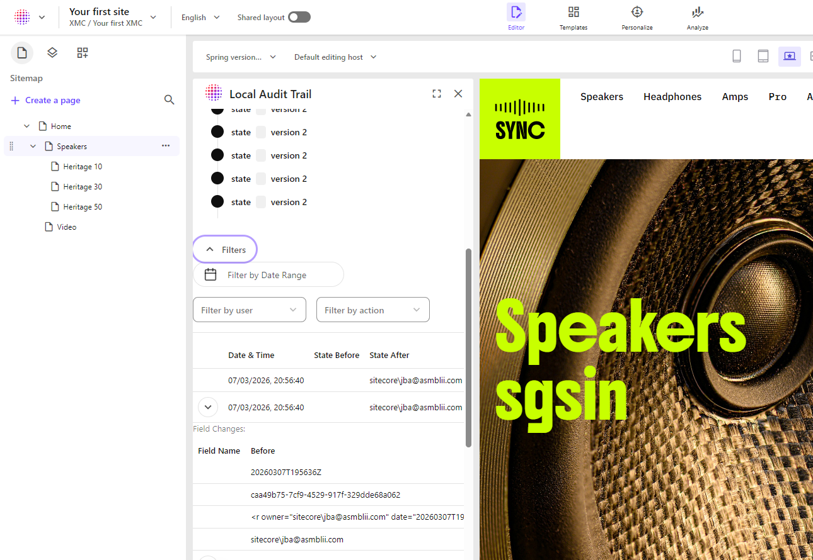
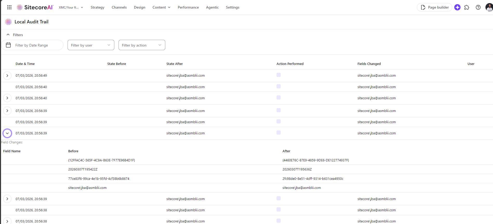

# Sitecore Hackathon 2026

- MUST READ: **[Submission requirements](SUBMISSION_REQUIREMENTS.md)**
- [Entry form template](ENTRYFORM.md)

## Team name

418 I'm a teapot

## Category

1. Best Marketplace App for Sitecore AI - Build something publishable. Not just a demo.

## Description

### Apparatus CIA brings Control, Insight and Audit\*\* to your Sitecore content lifecycle.

#### The Why

Content operations move fast, not the least due to AI — and things get lost. Who changed what? When did it happen? Why did a piece of content stall being published? Governance and compliance demand clear answers.

The Sitecore marketplace app Apparatus CIA solves this through ensuring an audit trail, that extends the default "last modified by" flow and improves the more elaborate audit trail obtained through the workflow engine.

#### The What

Current features include:

- Manage revisions even within the same version of a content piece
- Track deletions in addition to creations and modifications
- Sort, filter and export of records of revision (export currently blocked due to widget is a sandboxed iframe with no option of allowing downloads)
- Inspect revisions in the context of an item
- See statistics on dashboard widgets (number of items published, fastest, slowest and average time from version creation to version published)
- Maintains an append-only strategy to the records of revisions

#### The How - Architecture

#### The Next

Upcoming features include:

- Compare revisions side-by-side with color indication of changes
- See indications if linked items have been deleted (internal links, datasources, images or documents)
- Set deletion and retention thresholds
- Revert revisions

## Video link

[Video Presenting Apparatus CIA ](https://asmblii.sharepoint.com/:v:/s/asmbliiApS/IQCF18DSbTnVQp2IF0oHDOumAZs2CTLQbsRkUU7O-krU6BI?e=Vn6QWX)

## Pre-requisites and Dependencies

- Sitecore Cloud user so can get an invite to SitecoreAI instance with running marketplace app.

## Installation instructions

When approved as a public Marketplace app by Sitecore, follow the steps from <https://doc.sitecore.com/mp/en/developers/marketplace/discovering-apps-in-the-public-marketplace.html#install-an-app> and select Apparatus CIA as the app you want to install.

Until then, **reach out to any of the team members to get invited to a SitecoreAI instance that has the app running**.

### Configuration

The app can be configured in Sitecore App Studio: <https://doc.sitecore.com/mp/en/developers/marketplace/configure-a-public-app.html>

## Usage instructions

Apparatus CIA is implemented to be available from the following extension points:

- Fullscreen
- Dashboard Widget
- Page builder context panel

### Fullscreen - table view

In the table view it is possible to get an overview of all revisions. It is possible to sort and filter the table based on relevant attributes such as date intervals, user, item, and template.

For each revision it can be seen exactly what fields has changed and what the value has changed from.

### Dashboard Widget

#### Publishing statistics

Get an overview, with the first of Apparatus CIA's dashboard widgets, of how fast and intensive your content team is working. Identify peak periods and potential bottlenecks by looking at numbers of finalized and published content pieces as well as the time they have been in the making. Compare it to key metrics for instance for fastest and slowest production time as well as the average time to produce a content piece in any given time period.

#### Workflow bottlenecks and overdue tasks

With the second widget you are enabled to select specific workflow states and provide a threshold counted in days and hours and based on your input see all item versions that are still pending in that state. The widget allows you to click directly on any version you want to pick up the work on and have you redirected to the page builder with that version in focus ready to work.

#### Page builder context panel

Being in the context of a specific item, you are able to open the page builder context panel and see two different views for the Records of Revisions for that item.

In the first view you will have a timeline overview of how the item has moved through a workflow
followed by a table of all the different versions even if in the same workflow state, which is not possible in the default workflow engine, and see the exact field changes. There are filtering options providing you with only relevant revisions, for instance made by the same author.

The second view pivots around the workflow states and can in the same way as the first be filtered, for instance to sepcific states. Again exact changes can be seen.

#### Standalone filtering

## Comments

The Marketplace app is conform to the requirements for being published as a Public app in accordance with:

https://doc.sitecore.com/mp/en/developers/marketplace/sitecore-security-checklist.html#regulatory-compliance

Required policies:

- [Privacy Policy](docs/policies/Privacy_Policy.md)
- [Data Processing Addendum](docs/policies/DPA.md)
